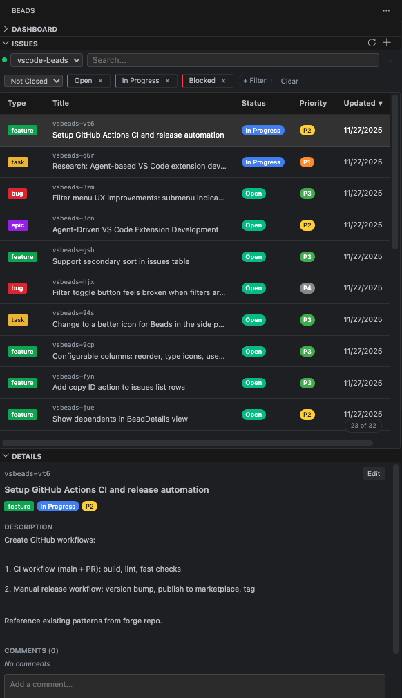

# Beads - VS Code Extension

VS Code extension for managing [Beads](https://github.com/steveyegge/beads) issues. Communicates with the Beads daemon via `bd` CLI.



## Features

- **Issues Panel**: Sortable, filterable table with search
- **Details Panel**: View/edit individual issues with markdown rendering
- **Multi-Project**: Auto-detects `.beads` directories, switch between projects
- **Daemon Management**: Auto-start option, status monitoring

## Requirements

- VS Code 1.85.0+
- Beads CLI (`bd`) in PATH
- Initialized project (`bd init`)

## Installation

```bash
# From source
bun install
bun run compile
# Press F5 to launch Extension Development Host

# Or install VSIX
code --install-extension beads-dashboard-0.1.0.vsix
```

## Usage

1. Initialize: `bd init`
2. Start daemon: `bd daemon start`
3. Click Beads icon in Activity Bar

### Issues Panel

- Click column headers to sort
- Search filters by title/description/ID
- Filter by status, priority, type via filter bar
- Show/hide columns via ⋮ menu
- Click row to view details

### Details Panel

- View/edit title, description, status, priority, type, labels
- Markdown rendering in description and notes fields
- Manage dependencies
- Click Edit to modify, Save to commit changes

## Commands

| Command | Description |
|---------|-------------|
| `Beads: Switch Project` | Select active project |
| `Beads: Refresh` | Refresh all views |
| `Beads: Create New Issue` | Create issue via quick input |
| `Beads: Start Daemon` | Start daemon for active project |
| `Beads: Stop Daemon` | Stop daemon |

## Settings

| Setting | Default | Description |
|---------|---------|-------------|
| `beads.pathToBd` | `"bd"` | Path to `bd` CLI |
| `beads.autoStartDaemon` | `true` | Auto-start daemon on project switch |
| `beads.refreshInterval` | `30000` | Auto-refresh interval in ms (0 = disable) |
| `beads.renderMarkdown` | `true` | Render markdown in text fields |

## Troubleshooting

**"No Beads projects found"** - Run `bd init` in project root

**"Daemon not running"** - Click "Start Daemon" or run `bd daemon start`

**Commands fail** - Check "Beads" output channel, verify `bd` in PATH

## License

Apache License 2.0
