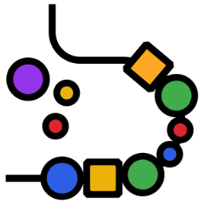
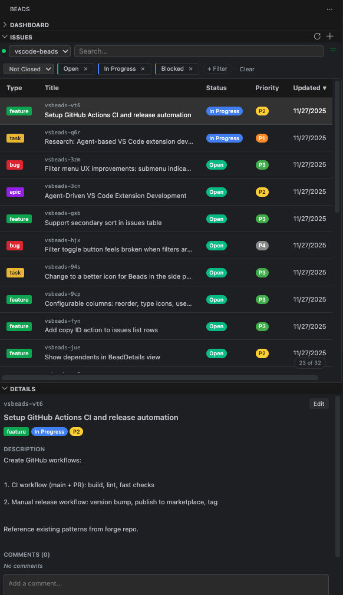

# Beads - VS Code Extension

VS Code extension for managing [Beads](https://github.com/steveyegge/beads) issues. Uses `bd` for project discovery and Dolt lifecycle control, and reads issue data directly from Dolt SQL for a faster UI.

## Features

**Kanban Board View**

- Toggle between Table and Board views for issues
- Drag cards between columns to change status
- See status distribution at a glance (Open, In Progress, Blocked, Closed)
- All columns collapsible for focused workflow (closed by default)
- Cards show title, ID, type, priority, assignee, and labels
- Filter-aware: shows "3/5" count when filters hide items
- Click any card to open details

**Issues Panel**

- Sortable, filterable table with global search
- Filter by status, priority, type, assignee, and labels
- Multi-column sorting (shift+click for secondary sort)
- Persistent column visibility, order, and sort preferences
- Filter presets: Not Closed, Blocked, Epics
- Click-to-copy bead IDs

**Details Panel**

- View/edit title, description, status, priority, type, labels, assignee
- Colored inline dropdowns for quick field editing
- Markdown rendering in description/notes with timezone-aware timestamps
- Dependency management with grouped relationship types (blocks, related, parent-child)

**Multi-Project & Dolt-Aware UI**

- Auto-detects `.beads` directories in workspace
- Project switcher and compact dashboard controls
- Direct Dolt-backed reads for issues, details, and comments
- Configurable Dolt change polling for near-real-time updates

## Development

See [docs/development.md](docs/development.md) for build commands, architecture, and beads setup.

## Requirements

- VS Code 1.85.0+
- Beads CLI (`bd`) in PATH
- Initialized project (`bd init`)

## Installation

Install from [VS Code Marketplace](https://marketplace.visualstudio.com/items?itemName=planet57.vscode-beads) or [Open VSX](https://open-vsx.org/extension/planet57/vscode-beads), or search "Beads" in VS Code/Cursor/VSCodium Extensions.

## Usage

1. Initialize: `bd init`
2. Click the Beads icon in the Activity Bar
3. If needed, use the dashboard controls to inspect/start/stop Dolt for the active project

### Issues Panel

- Click column headers to sort (shift+click for multi-column)
- Search by title, description, or bead ID
- Filter by status, priority, type, assignee, labels
- Use filter presets or create custom filter combinations
- Show/hide and reorder columns via ⋮ menu
- Click row to view details, click bead ID to copy

### Details Panel

- Click badges to edit type/status/priority inline
- "Assign to me" quick action for assignee
- Add/remove labels with auto-generated colors
- Markdown rendering in description/notes
- View dependencies grouped by relationship type

## Commands

| Command                   | Description                     |
| ------------------------- | ------------------------------- |
| `Beads: Switch Project`   | Select active project           |
| `Beads: Refresh`          | Refresh all views               |
| `Beads: Create New Issue` | Create issue via quick input    |
| `Beads: Start Dolt Server` | Start Dolt for active project  |
| `Beads: Stop Dolt Server`  | Stop Dolt for active project   |
| `Beads: Show Dolt Status`  | Log Dolt status for the project |

## Settings

| Setting                 | Default | Description                                         |
| ----------------------- | ------- | --------------------------------------------------- |
| `beads.pathToBd`          | `"bd"`  | Path to `bd` CLI                                     |
| `beads.refreshInterval`   | `3000`  | Dolt change polling interval in ms (0 = disable)     |
| `beads.renderMarkdown`    | `true`  | Render markdown in text fields                       |
| `beads.userId`            | `""`    | Your user ID for "Assign to me" (defaults to $USER)  |
| `beads.tooltipHoverDelay` | `1000` | Delay in ms before showing tooltip on hover (0 = disable) |

## Troubleshooting

**"No Beads projects found"** - Run `bd init` in project root

**Dolt not available / issues not loading** - Use the dashboard actions to inspect Dolt status or start the Dolt server for the active project

**Commands fail** - Check "Beads" output channel, verify `bd` in PATH

## Credits

Built with ❤️ using [Claude Code](https://claude.ai/code)

Icon inspired by <a href="https://www.flaticon.com/free-icons/beads" title="Beads icons">Beads icons created by imaginationlol - Flaticon</a>

Issue type icons from [Font Awesome Free](https://fontawesome.com) ([CC BY 4.0](https://creativecommons.org/licenses/by/4.0/))

## License

Apache License 2.0
