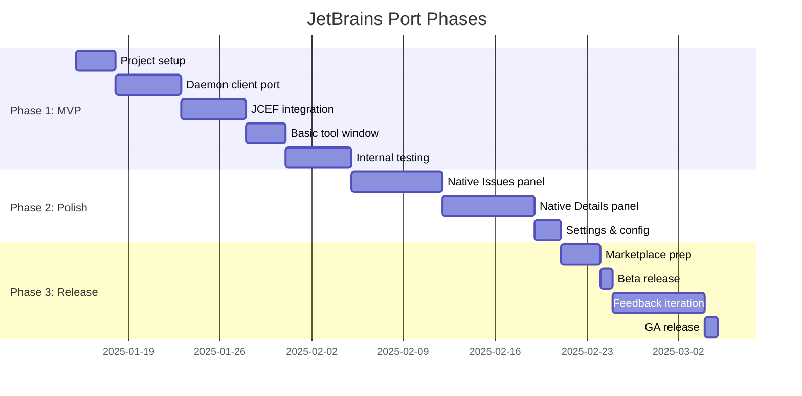

# JetBrains IDEA Platform Port Analysis

Analysis of porting vscode-beads to the JetBrains IntelliJ Platform.

## Executive Summary

Porting vscode-beads to JetBrains requires a **full rewrite of the extension host layer** (~1200 LOC) while potentially **reusing the React webview layer** (~3000 LOC) via JCEF embedding. The architectures are fundamentally different—VS Code uses TypeScript/Node.js with webview-based UIs, while IntelliJ uses Kotlin/Java with Swing or Compose-based UIs.

| Approach | Effort | Risk | Maintenance |
|----------|--------|------|-------------|
| Native Kotlin/Swing | High (3-4 months) | Low | Best |
| JCEF + React reuse | Medium (2-3 months) | Medium | Moderate |
| Compose/Jewel | Medium (2-3 months) | Medium-High | Good (future) |

**Recommendation**: Native Kotlin with Kotlin UI DSL for production quality. JCEF embedding viable for faster initial release.

---

## Table of Contents

1. [Current Architecture](#current-architecture)
2. [JetBrains Platform Overview](#jetbrains-platform-overview)
3. [Porting Approaches](#porting-approaches)
4. [Component Mapping](#component-mapping)
5. [Build & Tooling](#build--tooling)
6. [Marketplace & Distribution](#marketplace--distribution)
7. [Effort Estimates](#effort-estimates)
8. [Risks & Mitigations](#risks--mitigations)
9. [Recommendation](#recommendation)

---

## Current Architecture

### Extension Structure

```
vscode-beads/
├── src/
│   ├── extension.ts          # VS Code entry point
│   ├── backend/
│   │   ├── BeadsBackend.ts         # CLI wrapper (deprecated)
│   │   ├── BeadsDaemonClient.ts    # RPC client (700 LOC) ✓ Reusable
│   │   ├── BeadsProjectManager.ts  # Project discovery, daemon lifecycle
│   │   └── types.ts                # Type definitions ✓ Reusable
│   ├── views/
│   │   ├── BaseViewProvider.ts     # Webview lifecycle
│   │   ├── BeadsPanelViewProvider.ts
│   │   ├── BeadDetailsViewProvider.ts
│   │   └── DashboardViewProvider.ts
│   └── webview/                    # React UI ✓ Potentially reusable
│       ├── App.tsx
│       ├── views/
│       ├── common/                 # 19 reusable components
│       └── styles.css
└── dist/
    ├── extension.js        # Node.js bundle
    └── webview/main.js     # Browser bundle (IIFE)
```

### Platform Dependencies

| Layer | Technology | JetBrains Equivalent |
|-------|------------|---------------------|
| Extension Host | VS Code API, Node.js | IntelliJ Platform API, JVM |
| Process Spawning | `child_process` | `ProcessBuilder`, `GeneralCommandLine` |
| Socket Communication | Node.js `net` | Java NIO / Netty |
| Webview UI | React + postMessage | JCEF or Swing/Compose |
| Configuration | `vscode.workspace.getConfiguration` | `PropertiesComponent`, `PersistentStateComponent` |
| Commands | `vscode.commands.registerCommand` | `AnAction` classes |
| Status Bar | `vscode.window.createStatusBarItem` | `StatusBarWidget` |

### Reusability Assessment

| Component | Lines | Reusable? | Notes |
|-----------|-------|-----------|-------|
| `BeadsDaemonClient.ts` | ~700 | 95% | JSON-RPC protocol is language-agnostic; socket handling needs adaptation |
| `types.ts` | ~200 | 100% | TypeScript → Kotlin data classes |
| React webview | ~3000 | 80-100% | Via JCEF; CSS variables need theme bridge |
| View providers | ~600 | 0% | VS Code API specific |
| Extension host | ~500 | 0% | Complete rewrite |

---

## JetBrains Platform Overview

### Architecture Differences

```
┌─────────────────────────────────────────────────────────────────┐
│                    VS Code Architecture                          │
├─────────────────────────────────────────────────────────────────┤
│  Extension Host (Node.js)                                        │
│  ├── Extension API                                               │
│  ├── Commands, Events, Configuration                            │
│  └── Webview Provider ──────┬──────────────────────────────────┤
│                             │ postMessage                        │
│  Webview (Chromium iframe)  │                                    │
│  └── React App ─────────────┘                                    │
└─────────────────────────────────────────────────────────────────┘

┌─────────────────────────────────────────────────────────────────┐
│                 IntelliJ Platform Architecture                   │
├─────────────────────────────────────────────────────────────────┤
│  Plugin (JVM - Kotlin/Java)                                      │
│  ├── Services (Application, Project, Module level)              │
│  ├── Actions (Commands)                                          │
│  ├── Tool Windows (Swing panels)                                 │
│  ├── Extensions & Extension Points                               │
│  └── JCEF Browser (optional) ──────────────────────────────────┤
│                             │ JBCefJSQuery                       │
│  Embedded Chromium          │                                    │
│  └── React App ─────────────┘                                    │
└─────────────────────────────────────────────────────────────────┘
```

### Key Platform Concepts

| Concept | Description |
|---------|-------------|
| **Services** | Singleton components at application/project/module scope |
| **Actions** | Command equivalents; extend `AnAction` |
| **Tool Windows** | Dockable panels in IDE sidebar/bottom |
| **Extension Points** | Plugin extensibility mechanism (like VS Code contributions) |
| **PSI** | Program Structure Interface for code analysis (not needed for beads) |
| **JCEF** | Java Chromium Embedded Framework for web UIs |

### Latest Platform Changes (2025.3)

- IntelliJ Community and Ultimate now delivered as unified platform
- New Search Everywhere API
- Compose/Jewel gaining official support
- JavaFX runtime removed (2025.1+)
- Kotlin 2.1.20 compatibility

**Sources**: [IntelliJ Platform 2025.3 Blog](https://blog.jetbrains.com/platform/2025/11/intellij-platform-2025-3-what-plugin-developers-should-know/), [Q3 2025 Newsletter](https://blog.jetbrains.com/platform/2025/11/busy-plugin-developers-newsletter-q3-2025/)

---

## Porting Approaches

### Approach 1: Native Kotlin with Swing/Kotlin UI DSL

**Description**: Full native port using Kotlin and the platform's native UI toolkit.

```kotlin
// Tool window factory
class BeadsToolWindowFactory : ToolWindowFactory {
    override fun createToolWindowContent(project: Project, toolWindow: ToolWindow) {
        val beadsService = project.service<BeadsProjectService>()
        val panel = BeadsPanel(beadsService)
        toolWindow.contentManager.addContent(
            ContentFactory.getInstance().createContent(panel, "Issues", false)
        )
    }
}

// Panel using Kotlin UI DSL
class BeadsPanel(private val service: BeadsProjectService) : JPanel() {
    init {
        layout = BorderLayout()
        add(panel {
            row {
                // Filter controls
            }
            row {
                // Issues table
            }
        }, BorderLayout.CENTER)
    }
}
```

**Pros**:
- Best IDE integration (theme, accessibility, keyboard shortcuts)
- Optimal performance
- Full access to platform APIs
- Easier maintenance long-term
- No JCEF dependency issues

**Cons**:
- Complete UI rewrite
- Learning curve for Swing/Kotlin UI DSL
- No code sharing with VS Code extension

**When to choose**: Production-quality plugin, long-term maintenance planned

### Approach 2: JCEF + React Reuse

**Description**: Embed existing React webview in JCEF browser component.

```kotlin
class BeadsJcefPanel(project: Project) : JPanel(BorderLayout()) {
    private val browser: JBCefBrowser
    private val jsQuery: JBCefJSQuery

    init {
        browser = JBCefBrowser()
        jsQuery = JBCefJSQuery.create(browser as JBCefBrowserBase)

        // Handle messages from React
        jsQuery.addHandler { message ->
            handleWebviewMessage(message)
            null
        }

        // Load React bundle
        val htmlUrl = javaClass.getResource("/webview/index.html")
        browser.loadURL(htmlUrl.toExternalForm())

        add(browser.component, BorderLayout.CENTER)
    }

    fun postMessage(message: String) {
        browser.cefBrowser.executeJavaScript(
            "window.postMessage($message, '*')",
            browser.cefBrowser.url, 0
        )
    }
}
```

**Pros**:
- Reuse ~3000 LOC of React components
- Faster initial development
- Consistent UI across VS Code and JetBrains
- Easier to maintain parity

**Cons**:
- JCEF adds complexity (startup, memory, CORS issues)
- Slight performance overhead
- Theme bridging requires work
- Communication via async message passing
- JCEF availability not guaranteed on all platforms

**When to choose**: Rapid prototyping, maintaining VS Code/JetBrains parity

### Approach 3: Compose/Jewel (Experimental)

**Description**: Use JetBrains' modern declarative UI framework.

```kotlin
@Composable
fun BeadsPanel(viewModel: BeadsViewModel) {
    JewelTheme {
        Column {
            FilterBar(viewModel.filters)
            LazyColumn {
                items(viewModel.beads) { bead ->
                    BeadRow(bead, onClick = { viewModel.selectBead(it) })
                }
            }
        }
    }
}
```

**Pros**:
- Modern declarative UI (similar mental model to React)
- Future-proof (JetBrains investing heavily)
- Good for developers familiar with Compose/SwiftUI/React
- Automatic theme integration via Jewel bridge

**Cons**:
- Not officially supported for plugins yet ("your mileage may vary")
- Smaller community, fewer examples
- Breaking changes possible
- Added complexity integrating with platform

**When to choose**: Forward-looking investment, team knows Compose, accepting risk

**Sources**: [Jewel GitHub](https://github.com/JetBrains/jewel), [Compose Plugin Template](https://github.com/JetBrains/intellij-platform-plugin-template)

---

## Component Mapping

### Extension Entry Point

**VS Code** (`extension.ts`):
```typescript
export function activate(context: vscode.ExtensionContext) {
    const projectManager = new BeadsProjectManager(context);
    // Register providers, commands, etc.
}
```

**JetBrains** (`plugin.xml` + services):
```xml
<idea-plugin>
    <extensions defaultExtensionNs="com.intellij">
        <projectService serviceImplementation="BeadsProjectService"/>
        <toolWindow id="Beads" factoryClass="BeadsToolWindowFactory"/>
    </extensions>
</idea-plugin>
```

### Project Discovery

**VS Code**: Workspace folders API + file system watching
```typescript
vscode.workspace.workspaceFolders?.forEach(folder => {
    const beadsDir = path.join(folder.uri.fsPath, '.beads');
    if (fs.existsSync(beadsDir)) { /* ... */ }
});
```

**JetBrains**: Project component + VirtualFileSystem
```kotlin
class BeadsProjectService(private val project: Project) {
    private val beadsRoot: VirtualFile?
        get() = project.baseDir?.findChild(".beads")
}
```

### Daemon Communication

The `BeadsDaemonClient` is mostly reusable. Port from TypeScript to Kotlin:

```kotlin
class BeadsDaemonClient(private val socketPath: Path) {
    private val objectMapper = ObjectMapper()

    suspend fun list(): List<Issue> = withContext(Dispatchers.IO) {
        val socket = if (isWindows()) {
            connectTcp(readTcpConfig())
        } else {
            UnixDomainSocketAddress.of(socketPath).let {
                SocketChannel.open(it)
            }
        }
        // JSON-RPC communication
        sendRequest(socket, "list", emptyMap())
    }
}
```

### Commands → Actions

**VS Code**:
```typescript
vscode.commands.registerCommand('beads.refresh', () => { /* ... */ });
```

**JetBrains**:
```kotlin
class RefreshBeadsAction : AnAction("Refresh", "Refresh beads", AllIcons.Actions.Refresh) {
    override fun actionPerformed(e: AnActionEvent) {
        val project = e.project ?: return
        project.service<BeadsProjectService>().refresh()
    }
}
```

### Configuration

**VS Code**:
```typescript
const config = vscode.workspace.getConfiguration('beads');
const pathToBd = config.get<string>('pathToBd', 'bd');
```

**JetBrains**:
```kotlin
@State(name = "BeadsSettings", storages = [Storage("beads.xml")])
class BeadsSettings : PersistentStateComponent<BeadsSettings.State> {
    data class State(
        var pathToBd: String = "bd",
        var autoStartDaemon: Boolean = true
    )
    var state = State()
    // ...
}
```

### Status Bar

**VS Code**:
```typescript
const statusItem = vscode.window.createStatusBarItem(StatusBarAlignment.Right);
statusItem.text = "$(server) Beads";
```

**JetBrains**:
```kotlin
class BeadsStatusBarWidget : StatusBarWidget, StatusBarWidget.TextPresentation {
    override fun getText(): String = "Beads: Running"
    override fun getTooltipText(): String = "Beads daemon status"
}
```

---

## Build & Tooling

### Project Structure

```
intellij-beads/
├── build.gradle.kts          # Kotlin DSL build script
├── settings.gradle.kts
├── gradle.properties
├── src/
│   └── main/
│       ├── kotlin/
│       │   └── com/example/beads/
│       │       ├── services/
│       │       ├── actions/
│       │       ├── toolwindow/
│       │       └── settings/
│       └── resources/
│           ├── META-INF/
│           │   └── plugin.xml
│           └── webview/        # If using JCEF approach
│               ├── index.html
│               └── main.js
└── gradle/
    └── wrapper/
```

### Gradle Configuration

```kotlin
// build.gradle.kts
plugins {
    id("org.jetbrains.kotlin.jvm") version "2.1.20"
    id("org.jetbrains.intellij.platform") version "2.6.0"
}

repositories {
    mavenCentral()
    intellijPlatform {
        defaultRepositories()
    }
}

dependencies {
    intellijPlatform {
        intellijIdeaCommunity("2025.1")  // or Ultimate for LSP
        bundledPlugin("com.intellij.java")
        instrumentationTools()
    }

    implementation("com.fasterxml.jackson.module:jackson-module-kotlin:2.17.0")
    implementation("org.jetbrains.kotlinx:kotlinx-coroutines-core:1.8.0")
}

intellijPlatform {
    pluginConfiguration {
        name = "Beads"
        version = "1.0.0"
        ideaVersion {
            sinceBuild = "251"
            untilBuild = "253.*"
        }
    }

    signing {
        certificateChainFile = file("chain.crt")
        privateKeyFile = file("private.pem")
        password = providers.environmentVariable("PRIVATE_KEY_PASSWORD")
    }

    publishing {
        token = providers.environmentVariable("PUBLISH_TOKEN")
    }
}
```

### Development Workflow

```bash
# Run plugin in sandboxed IDE
./gradlew runIde

# Build plugin distribution
./gradlew buildPlugin

# Verify plugin compatibility
./gradlew verifyPlugin

# Publish to Marketplace
./gradlew publishPlugin
```

**Sources**: [IntelliJ Platform Gradle Plugin 2.x](https://plugins.jetbrains.com/docs/intellij/configuring-plugin-project.html), [Kotlin DSL Primer](https://docs.gradle.org/current/userguide/kotlin_dsl.html)

---

## Marketplace & Distribution

### Publishing Requirements

| Requirement | Details |
|-------------|---------|
| **Plugin Signing** | Mandatory; use certificate chain from JetBrains CA |
| **Review Process** | Manual review by JetBrains team (no SLA) |
| **License** | EULA required; can be proprietary or open source |
| **File Size** | Max 400 MB |
| **First Upload** | Must be manual (subsequent via API/Gradle) |
| **Description** | First 40 chars must be English summary |
| **Logo** | Required, must not be default template logo |

### plugin.xml Configuration

```xml
<idea-plugin>
    <id>com.planet57.beads</id>
    <name>Beads</name>
    <vendor email="support@example.com" url="https://github.com/jdillon/intellij-beads">
        planet57
    </vendor>

    <description><![CDATA[
    Issue tracking integration for the Beads project management system.

    <ul>
        <li>View and manage issues in tool window</li>
        <li>Daemon lifecycle management</li>
        <li>Multi-project support</li>
    </ul>
    ]]></description>

    <depends>com.intellij.modules.platform</depends>

    <extensions defaultExtensionNs="com.intellij">
        <toolWindow id="Beads"
                    anchor="right"
                    factoryClass="com.planet57.beads.BeadsToolWindowFactory"
                    icon="/icons/beads.svg"/>
        <projectService serviceImplementation="com.planet57.beads.BeadsProjectService"/>
        <applicationConfigurable
            instance="com.planet57.beads.BeadsConfigurable"
            displayName="Beads"/>
    </extensions>

    <actions>
        <group id="Beads.Menu" text="Beads" popup="true">
            <add-to-group group-id="ToolsMenu" anchor="last"/>
            <action id="Beads.Refresh" class="com.planet57.beads.RefreshAction"/>
            <action id="Beads.CreateBead" class="com.planet57.beads.CreateBeadAction"/>
        </group>
    </actions>
</idea-plugin>
```

### Compatibility Matrix

| IDE | Minimum Version | Notes |
|-----|-----------------|-------|
| IntelliJ IDEA Community | 2025.1 | Full support |
| IntelliJ IDEA Ultimate | 2025.1 | Full support |
| PyCharm Community | 2025.1 | Full support |
| PyCharm Professional | 2025.1 | Full support |
| WebStorm | 2025.1 | Full support |
| GoLand | 2025.1 | Full support |
| Rider | 2025.1 | Full support |
| Android Studio | Ladybug | May require separate build |

### Versioning Strategy

Use SemVer with IDE version suffix:
- `1.0.0-251` for 2025.1
- `1.0.0-253` for 2025.3

Marketplace auto-serves correct version based on user's IDE.

**Sources**: [Publishing Guide](https://plugins.jetbrains.com/docs/marketplace/publishing-and-listing-your-plugin.html), [Approval Guidelines](https://plugins.jetbrains.com/docs/marketplace/jetbrains-marketplace-approval-guidelines.html), [Plugin Signing](https://plugins.jetbrains.com/docs/intellij/plugin-signing.html)

---

## Effort Estimates

### Native Kotlin Approach

| Component | Effort | Notes |
|-----------|--------|-------|
| Project setup & scaffolding | 2-3 days | Template + gradle config |
| Daemon client port | 3-5 days | TypeScript → Kotlin, socket handling |
| Project discovery service | 2-3 days | VFS integration |
| Tool window (Issues list) | 5-7 days | Table, sorting, filtering |
| Tool window (Details panel) | 5-7 days | Form layout, editing |
| Dashboard panel | 2-3 days | Statistics display |
| Settings/configuration | 1-2 days | PersistentStateComponent |
| Actions & menus | 1-2 days | Command equivalents |
| Status bar widget | 1 day | Daemon status |
| Testing & polish | 5-7 days | Edge cases, UX refinement |
| Marketplace prep | 2-3 days | Signing, listing, docs |
| **Total** | **~30-40 days** | ~6-8 weeks |

### JCEF + React Approach

| Component | Effort | Notes |
|-----------|--------|-------|
| Project setup & scaffolding | 2-3 days | Template + gradle config |
| Daemon client port | 3-5 days | TypeScript → Kotlin |
| Project discovery service | 2-3 days | VFS integration |
| JCEF integration | 3-5 days | Browser setup, message bridge |
| React bundle adaptation | 2-3 days | Theme bridge, postMessage API |
| Actions & menus | 1-2 days | Command equivalents |
| Settings/configuration | 1-2 days | PersistentStateComponent |
| Testing & polish | 3-5 days | JCEF quirks, cross-platform |
| Marketplace prep | 2-3 days | Signing, listing, docs |
| **Total** | **~20-30 days** | ~4-6 weeks |

---

## Risks & Mitigations

### Technical Risks

| Risk | Impact | Mitigation |
|------|--------|------------|
| JCEF unavailable on some platforms | High | Fall back to native UI or require JCEF runtime |
| CORS issues with local React bundle | Medium | Use resource server or data: URLs |
| Daemon socket handling on Windows | Medium | Test TCP fallback thoroughly |
| Platform API changes between versions | Medium | Use stable APIs, version matrix testing |
| Compose/Jewel instability | High | Avoid for production until officially supported |

### Organizational Risks

| Risk | Impact | Mitigation |
|------|--------|------------|
| Maintaining two codebases | High | Consider shared protocol/types package |
| Feature parity drift | Medium | Document shared features, sync releases |
| JetBrains review delays | Low | Submit early, iterate |

### Platform Differences to Watch

1. **No equivalent to VS Code's webview retainContextWhenHidden** - JCEF panels recreated on hide/show
2. **Different message passing** - JBCefJSQuery vs postMessage
3. **No workspace folders** - Single project per window (multi-project via modules)
4. **Settings scope** - Application vs Project vs Module levels

---

## Recommendation

### For Rapid Prototyping / MVP

**Use JCEF + React approach**:
1. Port daemon client to Kotlin
2. Embed existing React bundle via JCEF
3. Create thin tool window wrapper
4. Ship and iterate

### For Production Quality

**Use Native Kotlin approach**:
1. Full UI rewrite using Kotlin UI DSL
2. Better IDE integration
3. No JCEF dependency
4. Easier long-term maintenance

### Suggested Phased Approach



### Alternative: LSP Approach

If beads added a Language Server Protocol implementation, you could leverage JetBrains' LSP support. However:
- LSP is only available in paid JetBrains IDEs (not Community editions)
- LSP is meant for language features, not tool windows/UI
- Would still need native UI for tool windows

**Not recommended** for this use case.

**Sources**: [LSP for Plugin Developers](https://blog.jetbrains.com/platform/2023/07/lsp-for-plugin-developers/), [LSP4IJ](https://github.com/redhat-developer/lsp4ij)

---

## Resources

### Official Documentation
- [IntelliJ Platform SDK](https://plugins.jetbrains.com/docs/intellij/welcome.html)
- [Tool Windows Guide](https://plugins.jetbrains.com/docs/intellij/tool-windows.html)
- [JCEF Guide](https://plugins.jetbrains.com/docs/intellij/embedded-browser-jcef.html)
- [Kotlin UI DSL](https://plugins.jetbrains.com/docs/intellij/kotlin-ui-dsl-version-2.html)
- [Plugin Template](https://github.com/JetBrains/intellij-platform-plugin-template)

### Community Resources
- [JetBrains Platform Slack](https://plugins.jetbrains.com/slack)
- [IntelliJ Platform Explorer](https://plugins.jetbrains.com/intellij-platform-explorer)
- [Plugin Development Forum](https://intellij-support.jetbrains.com/hc/en-us/community/topics/200366979-IntelliJ-IDEA-Open-API-and-Plugin-Development)

### Example Plugins
- [Markdown Preview](https://github.com/JetBrains/intellij-community/tree/master/plugins/markdown) - JCEF usage
- [GraphBuddy](https://medium.com/virtuslab/creating-intellij-plugin-with-webview-3b27c3f87aea) - WebView tutorial
- [Qodo Plugin](https://docs.qodo.ai/qodo-documentation/qodo-gen/getting-started/setup-and-installation/jetbrains-installation) - JCEF-based tool

---

## Appendix: Quick Start Template

To begin development:

```bash
# Clone template
git clone https://github.com/JetBrains/intellij-platform-plugin-template.git intellij-beads
cd intellij-beads

# Configure for beads
# Edit gradle.properties, plugin.xml, etc.

# Run in sandbox
./gradlew runIde
```

See [Creating a Plugin Gradle Project](https://plugins.jetbrains.com/docs/intellij/creating-plugin-project.html) for detailed setup.
